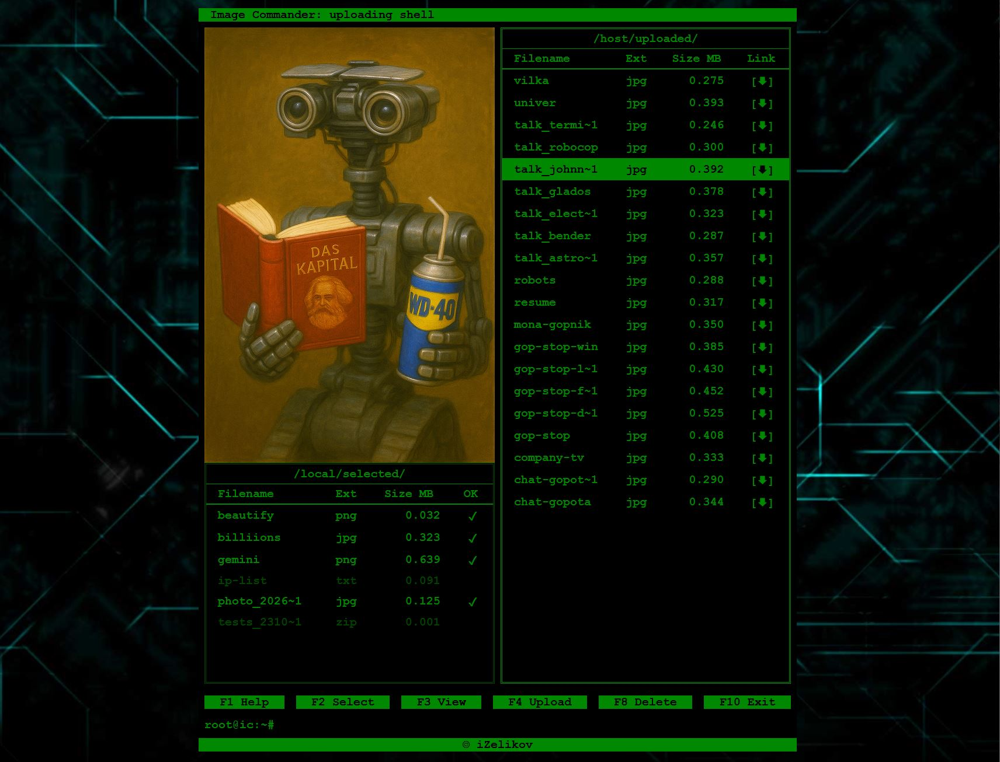
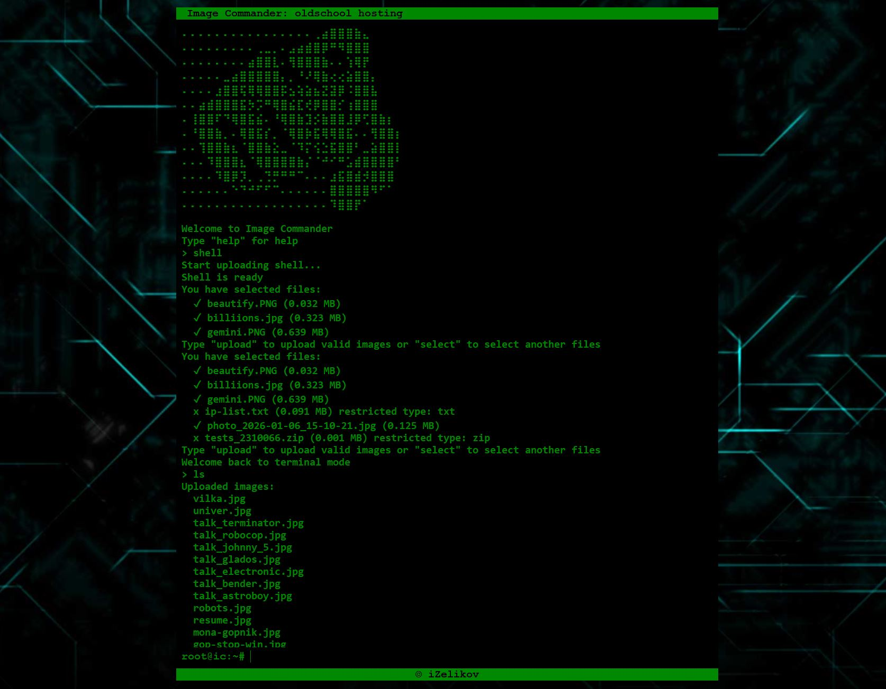

# Image Commander

[Демо сайт](http://ic.izelikov.ru/)

Перед вами лучший в мире хостинг картинок в терминальной стадии. Олды плачут от умиления и ностальгии, а зуммеры мечут спиннеры и грызут квадроберов в бессильной ярости. 

Никакой модерации, никаких прав доступа, без регистрации и СММ. Всё вокруг колхозное - всё вокруг моё. 

## Развёртывание
- Клонировать репозиторий.
- Перейти в папку проекта.
- Запустить скрипт *init.sh* командой `chmod +x init.sh ./init.sh`.
- Этот скрипт создаёт необходимые пустые папки для работы проекта (если их не было в репозитории). А также файл .env хранящий переменные среды (пароль для базы данных генерируется случайным образом). Можно отредактировать данный файл: поменять пароль, имя пользователя и имя базы данных на свои. 
- (альтернативный вариант без запуска скрипта): Переименовать файл .env-example в .env и заполнить его своими учётными данными для BD.
- (Опционально): Запустите `./html.sh` если вносили изменения в css/js (и у сайта уже были другие пользователи кроме вас ;), чтобы сбросить кэш браузера. 
- `docker compose up --build` (если не знаете, что это такое - срочно учить!).

## Подключение и API
- Фронтенд проекта доступен по http:// на 80 порту того сервера, где вы его развернули (или на *localhost*, если был развёрнут локально).
- Доступ по https:// пока не предусмотрен (в старые Dos'овские времена жили без богомерзких https'ов).
- `my_site/admin/` - доступ к админке базы данных, если захочется пошаманить ручками.
- `my_site/images/` - папка, для хранения всех загруженных картинок. Прямой доступ к папке запрещён, только по ссылке на конкретные файлы.
- `my_site/api/` - эндпоинт для всех API бэкенда
- `my_site/api/get_images/` - возвращает JSON со списком всех загруженных картинок. Ключи JSON: {'id', 'filename', 'original_filename', 'size', 'upload_time', 'file_type'}.
- `my_site/api/upload/` - принимает POST-запросы на загрузку картинок. 
- `my_site/api/delete/<filename>` - удаляет картинку с переданным именем (и не спрашивает никаких подтверждений!). Обратите внимание, что для удаления используется не оригинальное имя файла, а сгенерированное уникальное имя, под которым он хранится на сервере.  

## Лимиты и ограничения
Хостинг принимает файлы следующих типов:
- .jpg
- .jpeg
- .png
- .gif
- .webp

Владельцы надкушенных яблок с их сатанинскими `.heic` могут с горя погрызть зуммеров вместе с квадроберами. 

Максимальный размер загружаемого файла - 5 МБ.

Максимальный размер одного запроса (сумма размеров всех файлов) - 50 МБ. 
Если суммарный размер выбранных файлов превышает это значение, кнопка "Upload" будет заблокирована.
Команда "upload" в терминале будет возвращать ошибку.
Учитывается размер только валидных файлов. 

## Использование Image Commander
Приложение стартует в режиме терминала. В этом режиме можно выбирать, загружать, смотреть список загруженных картинок и удалять их с помощью команд, список которых доступен по команде help.

Командой shell можно перевести приложение в режим условно-графической оболочки. В которой уже можно кликать мышкой, скролить колёсиком, выбирать стрелками, закидывать файлы драг-эн-дропом и использовать горячие клавиши.

На левой панели отображаются файлы, выбранные для загрузки с цветовой дифференциацией штанов. Ярко-зелёным подсвечены файлы, прошедшие валидацию, тёмно-зелёным - не прошедшие. 

Нажатие кнопки Upload загружает все картинки классово-верного оттенка на сервер, а панель очищает. После чего можно выбрать следующую порцию файлов для загрузки. 

На правой панели отображаются уже загруженные на сервер картинки. Их можно посмотреть с помощью кнопки View или открыть в новом окне, кликнув по линку сбоку.  

## Резервное копирование
За автоматическое резервное копирование базы данных отвечает контейнер backup, созданный на основе образа `prodrigestivill/postgres-backup-local`. 
Копирование происходит в папку `/backups/`. 
При желании можно вручную создать резервную копию BD запуском скрипта *backup.sh* в корне проекта. Команда для запуска `./backup.sh`.

## Проблемы и (возможные) решения
- ~~Не стесняйтесь нажимать в браузере Ctrl+F5, на случай если у вас закэшировался старый CSS или JS.~~ (исправлено)
- Чтобы принудительно сбросить кэш для всех пользователей - запускайте `./html.sh` перед сборкой докера или даже прямо во время работы контейнеров.  
- ~~Сайт не оптимизирован для просмотра с мобильных устройств. Открывайте на телефоне на свой страх и риск.~~ (исправлено)
